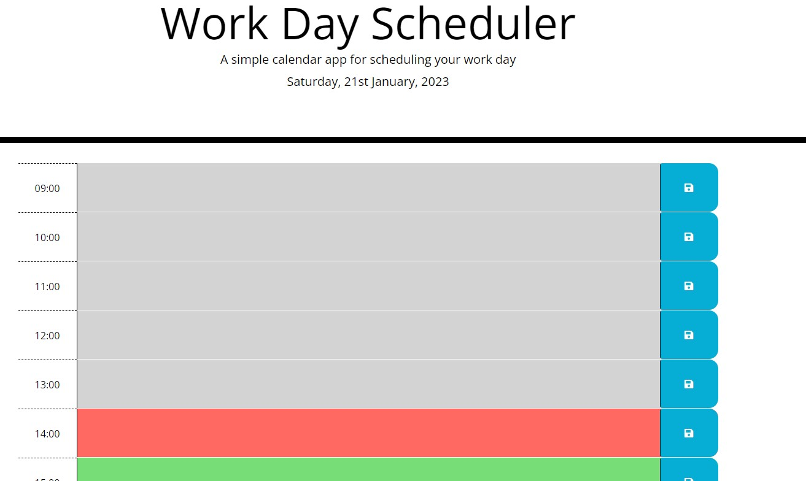
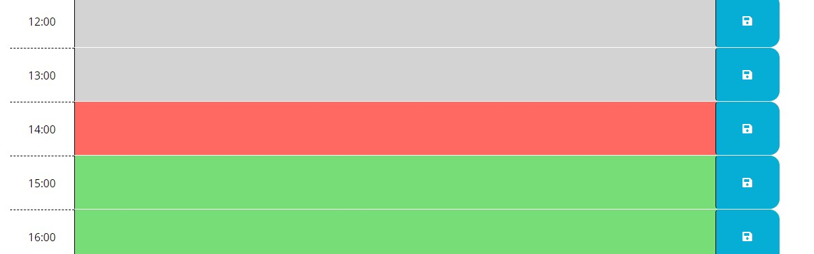
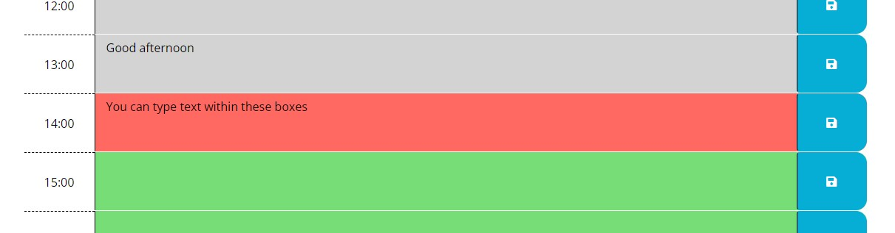
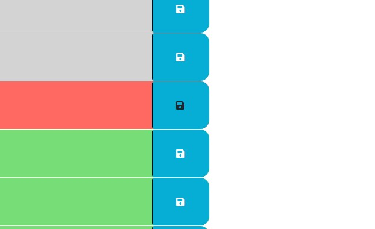

# WorkDayScheduler
a simple calendar application that allows a user to save events for each hour of the day

## Description 

This is a one day work scheduler where you can save information within the text field.
There is also a colour scheme that changes at time goes on.
Anything in the grey section has already passed, the red section is the current hour, the green section is what is yet to come.

## Usage 

To use this website:
- Choose which hour you would like to input information into.
- Type any information you require to be saved within the blank text box.
- Press the save button at the end of the hour slot.
- When you next come back to the page, your text will still be there.
- If you require to change the text or delete it, just modify within the text box and press the save button again.
- Upon reloading the page, the new text (or blank space if the text was deleted) will now be there instead.

(screenshot images below)

 
 
 
 

Link to active website: https://leanne-annable.github.io/WorkDayScheduler/

## Credits

I used the information from our previous lesson in class, and also w3schools for information regarding text areas and DOM navigation 

## License

This webpage is licenced under the MIT Licence

© 2023 edX Boot Camps LLC. Confidential and Proprietary. All Rights Reserved.